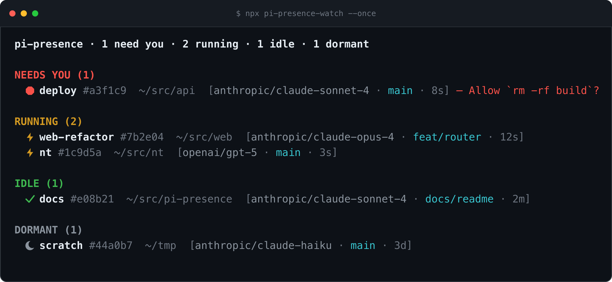

# pi-presence

Ambient session-status for the [pi coding agent](https://pi.dev). pi-presence
writes a small per-session state file on every transition, self-labels your
terminal tab, and gives you a live view of **every** pi session grouped by what
it needs from you — _needs-you_, _running_, _idle_, _dormant_.



> **Status:** early. The published extension (`pi-presence`) and the reader
> library (`@pi-presence/shared`) are the stable, tested core. `pi-watch` and
> `vee-pi-presence` are working readers built on top. macOS is the primary
> target; the state files and readers are cross-platform.

## Why

When you run several pi sessions across terminal tabs, you lose track of which
one is waiting on you, which is still working, and which is done. pi-presence
makes that state **ambient**: each session continuously publishes its status to
`~/.pi/agent/live/<session-id>.json`, and any reader can turn that directory
into a glanceable list or a menubar item.

## Packages

| Package | What it is | Published |
| --- | --- | --- |
| [`pi-presence`](packages/pi-presence) | The pi extension: writes state files, labels tabs, consumes/produces `herdr:blocked`, optional notifications. | npm |
| [`@pi-presence/shared`](packages/shared) | Zero-pi-dependency reader library: schema, liveness, watch/reconcile, view model, JSON Patch, terminal focus. | workspace-only (bundled into the reader) |
| [`pi-presence-watch`](packages/pi-watch) | Standalone terminal reader — a live grouped list of all sessions, plus `focus`/`gc` commands. | npm |
| [`vee-pi-presence`](packages/vee-pi-presence) | Vee menubar plugin: JSON-RPC + JSON Patch over stdio, with click-to-focus. | no |

## Install the extension

```sh
pi install npm:pi-presence
```

That's it — the extension ships TypeScript loaded by pi's `jiti`, no build step.
On the next session start you'll get a self-labeling tab and a state file per
session. To watch every session in another terminal:

```sh
npx pi-presence-watch            # live TUI
npx pi-presence-watch --once      # print once
npx pi-presence-watch focus <q>   # focus a session's terminal (or copy its resume)
npx pi-presence-watch gc          # prune dormant state files
```

## State file schema

One file per session id at `<agentDir>/live/<session-id>.json`, written
atomically (temp file + `rename`). The directory is resolved from pi's
`CONFIG_DIR_NAME`-aware agent dir (honoring `PI_CODING_AGENT_DIR`); readers can
also be pointed at it with `PI_PRESENCE_LIVE_DIR`.

```jsonc
{
  "schema": 1,                       // SCHEMA_VERSION; readers ignore files with a higher value
  "sessionId": "abc123",
  "sessionFile": "/Users/x/.pi/agent/sessions/abc123.jsonl",
  "sessionName": "nt",
  "state": "working",                // "working" | "blocked" | "idle" (dormant is reader-derived)
  "blockedLabel": "Allow rm -rf?",   // present only when state === "blocked"
  "cwd": "/Users/x/src/nt",
  "branch": "main",
  "model": "anthropic/claude-...",
  "pid": 45123,
  "startTime": 1721300000000,        // epoch ms; PID-reuse guard
  "bootId": null,
  "nonce": "uuid-v4",
  "updatedAt": 1721300012345,
  "terminal": {
    "program": "iTerm.app",
    "itermSessionId": "w0t1p0:UUID",
    "termSessionId": null,
    "ghosttyResource": null,
    "windowId": "12345",
    "tmux": null,
    "tmuxPane": null,
    "titleMarker": "⚡ nt · working"
  }
}
```

**States.** The writer only ever emits `working`, `blocked`, or `idle`.
`dormant` is **reader-derived**: a reader marks a file dormant when its `pid`
(guarded by `startTime`) is no longer a live process.

**Forward compatibility.** Readers ignore files whose `schema` exceeds the
version they understand, and treat any unknown `state` value as `idle`.

**Liveness.** Readers probe `process.kill(pid, 0)` (`ESRCH` → gone, `EPERM` →
alive-not-ours) and compare `startTime` (estimated via `ps -o etimes=`) to catch
PID reuse. Files for dead processes older than a TTL (default 24h) are
garbage-collected; the extension also unlinks its own file on a `quit` shutdown.

## Settings

Add a `pi-presence` block to `<agentDir>/settings.json` (global). A project
`.pi/settings.json` block overrides the global one per key. A mistyped key
(e.g. `enabled: "false"` as a string) falls back to its default and prints a
one-line warning to stderr rather than being silently ignored.

```jsonc
{
  "pi-presence": {
    "enabled": true,                       // master switch
    "title": true,                         // emit the terminal tab title (TUI + TTY only)
    "titleFormat": "{icon} {name} · {state}", // {icon} {name} {state} {cwd} {branch}
    "notify": false,                       // desktop notifications (macOS)
    "idleDebounceMs": 250,                 // collapse working→idle→working flicker
    "retryGraceMs": 2500,                  // re-check delay when a settle fires mid-retry
    "notifyThresholdMs": 10000             // min working time before a "finished" notification
  }
}
```

## The `herdr:blocked` contract

pi-presence surfaces the highest-value state — "needs-you" — cooperatively,
rather than by patching `ctx.ui.*` (unsupported) or intercepting `tool_call`
(only catches tool calls, not arbitrary dialogs). Any extension that puts pi
into a wait emits, on the shared event bus:

```ts
pi.events.emit("herdr:blocked", { active: true, label: "Allow rm -rf?" });
// …later…
pi.events.emit("herdr:blocked", { active: false });
```

pi-presence **consumes** these with ref-counting (blocked while depth > 0). It
also ships an optional **producer**, the `permission-gate` extension, which
brackets a confirmation for risky shell commands with the same events — so
pi-presence is self-sufficient and still interoperates with herdr, pi-worktree,
and other cooperating extensions. Enable it explicitly:

```jsonc
{ "source": "npm:pi-presence", "extensions": ["./extensions/index.ts", "+permission-gate/index.ts"] }
```

> The `{ active, label? }` payload and ref-count semantics follow the herdr
> convention. Confirm against the real `herdr-agent-state.ts` before relying on
> cross-tool interop — see [Caveats](#caveats).

## Click-to-focus

Readers can bring a session's terminal tab to the front using the captured
`terminal` snapshot, best correlation first:

- **iTerm2** — by `$ITERM_SESSION_ID` via the Python API
  (`get_session_by_id` + `async_activate(select_tab=True, order_window_front=True)`).
- **Ghostty (1.3.0+)** — by working directory + the OSC `titleMarker` (the
  AppleScript terminal class exposes neither PID nor TTY yet — issue #11592).
- **Terminal.app** — by the `titleMarker` (no per-session id).
- **tmux** — `select-window` / `select-pane` on `$TMUX_PANE` first.

When focus isn't possible, readers fall back to the resume command
(`pi --session <file>`), which they can copy to the clipboard.

## Development

```sh
npm install
npm run check        # lint + typecheck + schema-sync + test
npm test             # vitest across all workspaces
npm run lint         # biome
npm run typecheck    # tsc --noEmit per workspace
npm run assets:demo  # regenerate the placeholder gallery image
```

Requires Node ≥ 22. The canonical state schema lives in
`packages/shared/src/schema.ts`; the extension keeps a **byte-identical** copy in
`packages/pi-presence/src/schema.ts` (so its tarball has no workspace
dependency), enforced by `npm run check:schema-sync`.

## Publishing

Two packages publish to npm: `pi-presence` (the extension) and
`pi-presence-watch` (the reader CLI, bundled so it has no runtime deps). The
`@pi-presence/shared` library is bundled into the reader, not published.

CI publishing uses **npm Trusted Publishing (OIDC)** — no `NPM_TOKEN` secret is
stored anywhere. The `publish-npm` workflow requests a short-lived token via
OIDC (`id-token: write`) and attaches **provenance**. This needs the repo to be
public (it is) and a one-time setup on npm.

**First publish (bootstrap).** A trusted publisher can only be configured for a
package that already exists, so publish each package once from your machine:

```sh
npm ci && npm run build
npm login
npm publish --workspace pi-presence --access public         # add --dry-run to validate
npm publish --workspace pi-presence-watch --access public   # prepack builds the bundle
```

**Then enable token-free CI publishing** — on npmjs.com, for each of
`pi-presence` and `pi-presence-watch`: Settings → Trusted Publisher → add GitHub
`navbytes/pi-presence` with workflow `publish-npm.yml`.

**Subsequent releases:**

1. Bump `version` in `packages/pi-presence/package.json` and add a matching
   `## <version>` section to `packages/pi-presence/CHANGELOG.md`.
2. Tag it: `git tag vX.Y.Z && git push --tags`. The `release` workflow verifies
   the tag matches the package version, runs `npm run check` + `npm run build`,
   and creates the GitHub Release (notes from the CHANGELOG section).
3. Run the `publish-npm` workflow (leave `dry-run` on first to pack & validate,
   then run it with `dry-run` off) — it publishes both packages via OIDC with
   provenance, no secret required.

> Prefer a stored token instead? Set an `NPM_TOKEN` repo (or GitHub org) secret,
> add `env: NODE_AUTH_TOKEN: ${{ secrets.NPM_TOKEN }}` to the publish step, and
> drop `--provenance` / `id-token`. Trusted publishing is recommended now that
> the repo is public.

## Caveats

- Writing OSC to stdout during a TUI render is the community pattern for tab
  titles but is fragile (pi #2388, oh-my-pi #658). Emission is guarded on
  `ctx.mode === "tui"` and `process.stdout.isTTY`, and the title may not survive
  every full repaint.
- The `herdr:blocked` payload shape, ref-count semantics, and the retry-grace
  value are the assumed contract; only `idleDebounceMs = 250` is confirmed.
- Vee has no public plugin API. `packages/vee-pi-presence/vee.plugin.json` and
  the `vee.*` bindings are assumptions; only the stdio JSON-RPC + JSON Patch
  contract in `src/` is stable.
- macOS TCC (Automation) and Notification permission prompts appear on first use
  and cannot be scripted; readers fail open (a duplicate beats a missed alert)
  and fall back to copy-to-clipboard when focus is denied.

## License

[MIT](LICENSE)
